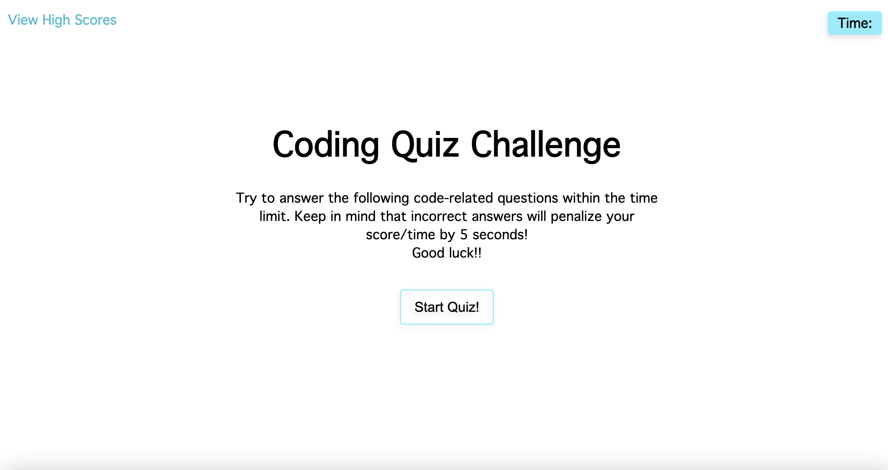

# 4-code-quiz
Web APIs Challenge: Code Quiz

## **Description**
The purpose of this project was to create a coding quiz that is timed and presents the user with their highscore at the end of the quiz.

**Link to deployed Github page ➝** [https://abbygraves.github.io/4-code-quiz/](https://abbygraves.github.io/4-code-quiz/)

 

## **Built With:**
+ HTML
+ CSS 
+ JavaScript 

 

## **What I Did**
+ Created questions array that includes questions, choices, and answers for each
+ Display first question when start button is clicked and begin the timer
+ Display next question when a choice button is clicked
+ Notify user if they're choice selection is correct or incorrect
+ Give the user the ability to eneter thier initials and save their highscore
